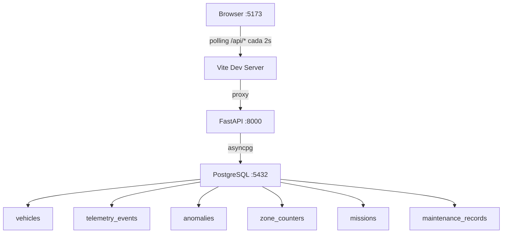

# Mapa del Proyecto — Fleet Telemetry Monitoring Service

## Qué es este proyecto

Un servicio de monitoreo en tiempo real para una flota de 50 vehículos autónomos de almacén. El sistema recibe eventos de telemetría desde los vehículos, detecta anomalías automáticamente, lleva conteo de entradas por zona, y expone un dashboard web que se actualiza cada 2 segundos.

Fue construido como un take-home challenge fullstack usando Python/FastAPI en el backend, React/TypeScript en el frontend, y PostgreSQL como base de datos. Todo el entorno local corre con Docker Compose.

---

## Qué pedía el challenge

El enunciado pedía:

- Ingerir eventos de telemetría de vehículos (batería, velocidad, estado, posición, zona).
- Detectar anomalías en tiempo real: batería baja, falla de vehículo, códigos de error, velocidad excesiva.
- Llevar un conteo concurrentemente seguro de entradas por zona de almacén.
- Manejar la transición a estado `fault` de forma atómica: cancelar misiones activas y crear un registro de mantenimiento en una sola transacción.
- Exponer un dashboard visual con el estado de la flota, batería, anomalías y conteo de zonas.
- Documentar las decisiones de arquitectura y el uso de herramientas de IA.

---

## Arquitectura final

```
┌─────────────────────────────────────────────────────────┐
│  Browser :5173                                          │
│   └─ Vite dev server                                    │
│        └─ proxy /api/* → http://backend:8000/api/*      │
└────────────────────────┬────────────────────────────────┘
                         │ HTTP (polling cada 2s)
┌────────────────────────▼────────────────────────────────┐
│  FastAPI :8000                                          │
│   ├── POST /api/telemetry   ← ingestión + anomalías     │
│   ├── GET  /api/vehicles    ← lista con última anomalía │
│   ├── PATCH /api/vehicles/{id}/status ← fault atómica   │
│   ├── GET  /api/fleet/state ← conteo por status         │
│   ├── GET  /api/zones/counts ← entradas por zona        │
│   └── GET  /api/anomalies  ← historial filtrable        │
└────────────────────────┬────────────────────────────────┘
                         │ asyncpg (async)
┌────────────────────────▼────────────────────────────────┐
│  PostgreSQL :5432                                       │
│   ├── vehicles          ← estado snapshot por vehículo  │
│   ├── telemetry_events  ← log completo (fuente verdad)  │
│   ├── anomalies         ← detección persistida          │
│   ├── zone_counters     ← contadores atómicos           │
│   ├── missions          ← misiones activas/canceladas   │
│   └── maintenance_records ← registros de mantenimiento  │
└─────────────────────────────────────────────────────────┘
```



---

## Por qué se empezó por la estructura (decisión senior)

Antes de implementar una sola línea de lógica de negocio, se definió y creó la estructura completa de carpetas y archivos vacíos. Esto no fue improvisación ni burocracia: fue una decisión intencional con consecuencias concretas.

**La estructura elegida fue:**

```
backend/app/
├── api/         ← rutas HTTP (controladores delgados)
├── schemas/     ← modelos Pydantic (request/response)
├── services/    ← lógica de negocio
├── repositories/← acceso a base de datos
├── models/      ← modelos ORM de SQLAlchemy
├── core/        ← configuración y engine de DB
└── constants/   ← zonas hardcoded

frontend/src/
├── components/  ← UI presentacional
├── hooks/       ← polling y estado
├── services/    ← llamadas fetch a la API
└── types/       ← interfaces TypeScript

docs/            ← ADR y AI_LOG
docker-compose.yml
```

**Por qué esto es criterio senior:**

1. **Separación de responsabilidades HTTP / lógica**: los routers de FastAPI solo validan el request y llaman a un servicio. No tienen SQL. No tienen reglas de negocio.

2. **Límites transaccionales explícitos en services**: las operaciones que deben ir juntas (como la fault transition) viven en una sola función en `services/vehicle.py`. Eso hace que el `commit()` y el `rollback()` sean predecibles.

3. **Acceso a datos aislado en repositories**: si mañana se cambia el ORM o la DB, los services no cambian. Los repositories son wrappers delgados de SQLAlchemy sin lógica.

4. **Schemas de Pydantic separados de modelos ORM**: el modelo ORM representa la tabla. El schema Pydantic valida el request y forma la response. Mezclarlos causa confusión sobre qué se puede exponer.

5. **Frontend con capa de servicios y hooks**: el componente React no hace fetch directamente. Hay una capa `api.ts` y un hook `useFleetData`. El componente recibe datos ya preparados.

6. **Validación paso a paso del trabajo generado con IA**: al tener carpetas separadas, cada sesión de prompts tenía un scope claro. Los modelos se revisaron antes de escribir los services. Los services se revisaron antes de escribir los tests. Eso hizo posible auditar el output de la IA en piezas pequeñas.

7. **Evitar el prompt monolítico**: pedirle a un LLM que construya todo en un solo prompt produce código difícil de auditar. La estructura obligó a iterar en capas. Cada prompt tenía un output verificable.

---

## Secuencia de desarrollo

El proyecto se construyó en este orden deliberado:

| # | Etapa | Descripción |
|---|-------|-------------|
| 1 | Estructura | Carpetas, Dockerfiles, requirements, boilerplate mínimo |
| 2 | Modelos y DB | ORM models, schemas Pydantic, migración Alembic, seed script |
| 3 | Corrección migración | Fix del error de enum duplicado en PostgreSQL |
| 4 | Services y endpoints | Lógica de negocio completa, routers FastAPI |
| 5 | Tests del backend | pytest con PostgreSQL real, 30 tests |
| 6 | Fix infraestructura async | NullPool, event loop único, TRUNCATE |
| 7 | Frontend API layer | Types, fetch wrappers, hooks de polling |
| 8 | Dashboard UI | Componentes React, CSS, estados de carga/error |
| 9 | Documentación final | README, ADR, AI_LOG, limpieza |

Este orden no es arbitrario: no se puede implementar un service sin modelos, no se puede probar sin services, y no se puede construir el frontend sin que la API esté estable.

---

## Orden recomendado de lectura

Para entender el proyecto completo, leer en este orden:

1. `docs/ADR.md` — Decisiones de arquitectura y trade-offs
2. `backend/app/models/` — Las tablas: qué datos vive en la DB
3. `backend/app/schemas/telemetry.py` — El request principal con validaciones
4. `backend/app/services/telemetry.py` — Flujo completo de ingestión
5. `backend/app/repositories/zone.py` — El upsert atómico
6. `backend/app/services/vehicle.py` — La fault transition con SELECT FOR UPDATE
7. `backend/tests/test_zones.py` — El test de concurrencia
8. `backend/tests/conftest.py` — La solución final de async test infrastructure
9. `frontend/src/hooks/useFleetData.ts` — Polling y estado del dashboard
10. `frontend/src/App.tsx` — Composición final del dashboard
